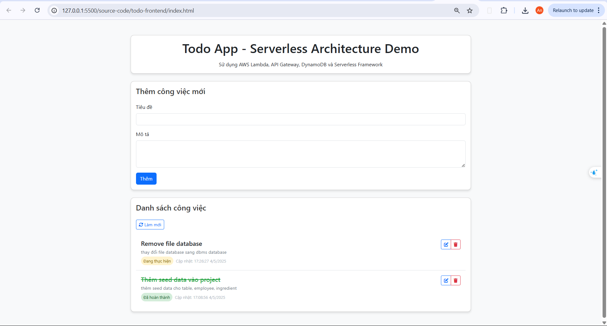
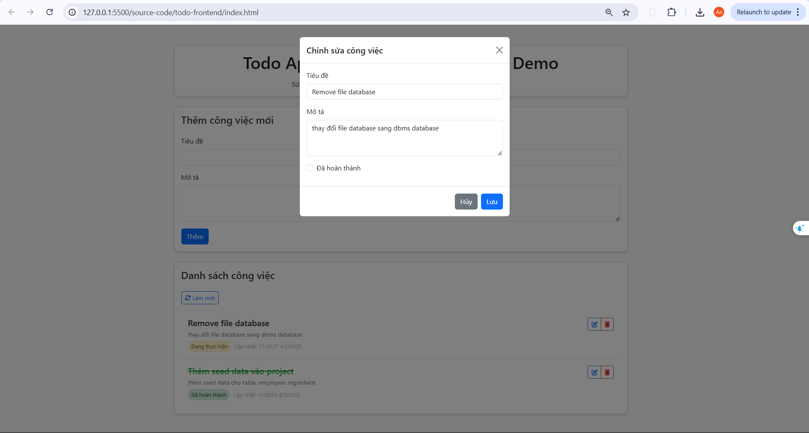
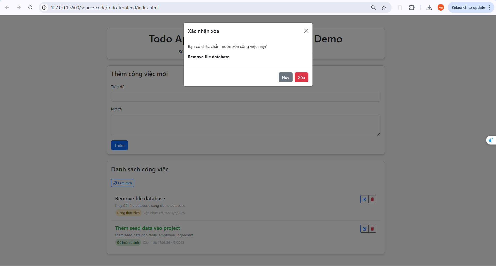
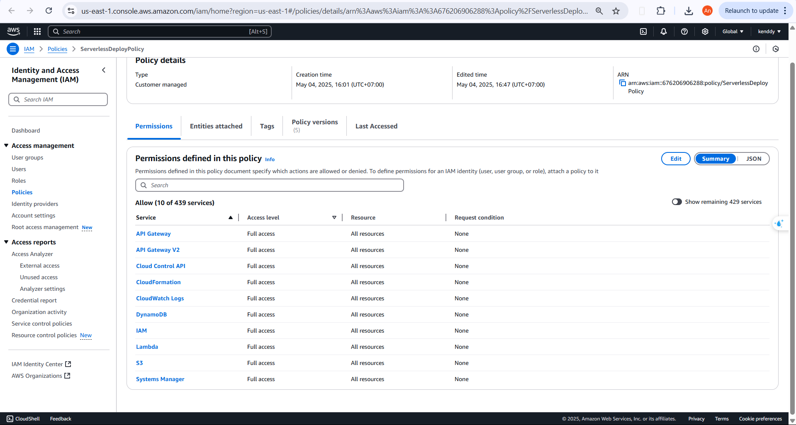
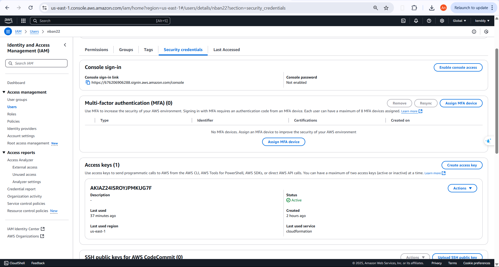
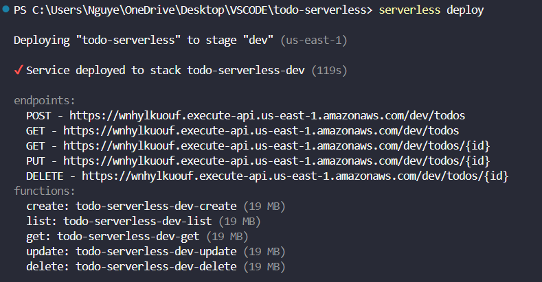
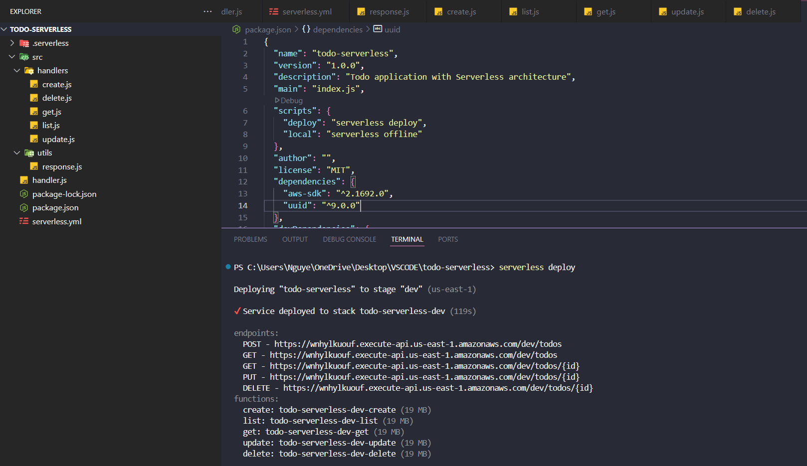

# BÁO CÁO TRIỂN KHAI ỨNG DỤNG TODOLIST TRÊN NỀN TẢNG SERVERLESS

## 1. Giới thiệu về Serverless

### 1.1 Khái niệm Serverless

Serverless là mô hình điện toán đám mây cho phép nhà phát triển xây dựng và triển khai ứng dụng mà không cần quản lý cơ sở hạ tầng máy chủ. Trong mô hình này, nhà cung cấp dịch vụ đám mây (như AWS, Azure, Google Cloud) chịu trách nhiệm cấp phát và quản lý tài nguyên máy chủ, cho phép nhà phát triển tập trung vào mã nguồn của ứng dụng.

Trong ứng dụng TodoList mà chúng tôi đã phát triển, các hàm xử lý (tạo, đọc, cập nhật, xóa công việc) được triển khai dưới dạng AWS Lambda functions - một trong những dịch vụ serverless phổ biến nhất hiện nay. Mỗi function này chỉ chạy khi có yêu cầu từ người dùng và tự động tắt sau khi hoàn thành công việc.

### 1.2 Các thành phần chính của kiến trúc Serverless

Kiến trúc Serverless thường bao gồm các thành phần sau:

1. **Function as a Service (FaaS)**: Cho phép triển khai các hàm xử lý riêng biệt, trong ứng dụng của chúng tôi là AWS Lambda.
2. **API Gateway**: Cung cấp REST API để kích hoạt các hàm, đóng vai trò cổng giao tiếp giữa client và serverless backend.
3. **Cơ sở dữ liệu**: Nơi lưu trữ dữ liệu, thường là dịch vụ quản lý như Amazon DynamoDB.
4. **Dịch vụ lưu trữ**: Nơi lưu trữ nội dung tĩnh như AWS S3 để hosting giao diện người dùng.

Ứng dụng TodoList của chúng tôi sử dụng đầy đủ các thành phần này, tạo nên một hệ thống serverless hoàn chỉnh.

## 2. Lợi ích của Serverless và ứng dụng thực tế

### 2.1 Lợi ích chính

1. **Không cần quản lý máy chủ**: Trong ứng dụng TodoList, chúng tôi không phải lo về việc cấu hình, bảo trì hay quản lý bất kỳ máy chủ nào. AWS quản lý toàn bộ cơ sở hạ tầng cần thiết để chạy Lambda functions.

2. **Tự động mở rộng**: Hệ thống tự động mở rộng khi có nhiều người dùng truy cập cùng lúc. Ví dụ, nếu có đột biến người dùng thêm công việc mới, Lambda function `create.js` sẽ tự động được nhân bản để xử lý tất cả các yêu cầu mà không cần can thiệp thủ công.

3. **Thanh toán theo sử dụng**: Chúng tôi chỉ trả tiền khi có người dùng thực hiện các thao tác trong ứng dụng. Nếu không có ai sử dụng, chi phí gần như bằng 0. Với ứng dụng TodoList có quy mô nhỏ, chi phí hàng tháng có thể chỉ vài USD.

4. **Giảm gánh nặng vận hành**: Không cần đội ngũ vận hành để theo dõi máy chủ 24/7. Hệ thống giám sát AWS CloudWatch tự động theo dõi và ghi lại lỗi nếu có.

### 2.2 Ứng dụng thực tế

Ứng dụng TodoList của chúng tôi minh họa rõ nét các lợi ích trên:

- **API CRUD đơn giản**: Các chức năng cơ bản (tạo, đọc, cập nhật, xóa công việc) được triển khai thành các Lambda functions riêng biệt, mỗi function chỉ phụ trách một nhiệm vụ cụ thể.
- **Cơ sở dữ liệu NoSQL**: Việc lưu trữ dữ liệu công việc trong DynamoDB cho phép lưu trữ và truy vấn dữ liệu hiệu quả mà không cần quản lý cơ sở dữ liệu.
- **Giao diện người dùng tĩnh**: Frontend được lưu trữ trên S3, cung cấp hiệu suất cao và chi phí thấp.

## 3. Kiến trúc của Ứng dụng TodoList Serverless

### 3.1 Tổng quan kiến trúc

Ứng dụng TodoList được xây dựng với kiến trúc serverless hoàn chỉnh bao gồm:

- **Frontend**: HTML, CSS, JavaScript được hosting trên Amazon S3
- **API Layer**: Amazon API Gateway để định tuyến các request
- **Backend Functions**: AWS Lambda functions viết bằng Node.js
- **Database**: Amazon DynamoDB để lưu trữ dữ liệu công việc

### 3.2 Luồng xử lý

Khi người dùng tương tác với ứng dụng, các sự kiện được xử lý theo luồng sau:

1. Người dùng gửi request từ giao diện (ví dụ: thêm công việc mới)
2. Request được gửi đến Amazon API Gateway
3. API Gateway kích hoạt Lambda function tương ứng (ví dụ: `create.js`)
4. Lambda function xử lý logic và tương tác với DynamoDB
5. Lambda trả về kết quả cho API Gateway
6. API Gateway trả response về giao diện người dùng

Mô hình này đảm bảo hiệu suất cao và khả năng mở rộng tự động.

## 4. Giao diện Frontend

### 4.1 Trang chính



Giao diện người dùng của ứng dụng TodoList bao gồm các thành phần chính:
- Form thêm công việc mới với trường tiêu đề và mô tả
- Danh sách công việc hiển thị tất cả các công việc hiện có
- Các nút thao tác để chỉnh sửa hoặc xóa công việc

### 4.2 Modal chỉnh sửa



Khi người dùng nhấn nút chỉnh sửa, một modal hiện lên cho phép:
- Chỉnh sửa tiêu đề và mô tả công việc
- Đánh dấu công việc đã hoàn thành
- Lưu hoặc hủy thay đổi

### 4.3 Xác nhận xóa



Modal xác nhận xóa giúp người dùng tránh xóa công việc do nhầm lẫn.

## 5. Hướng dẫn triển khai và cài đặt

### 5.1 Chuẩn bị môi trường và yêu cầu

#### 5.1.1 Công cụ cần thiết
- Node.js (phiên bản 16.x trở lên)
- NPM (Node Package Manager)
- AWS CLI (AWS Command Line Interface)
- Serverless Framework (phiên bản 3.x hoặc 4.x)

#### 5.1.2 Tài khoản AWS và cấu hình
1. Tạo tài khoản AWS nếu chưa có
2. Tạo IAM User với quyền cần thiết:
   - AWSLambdaFullAccess
   - AmazonAPIGatewayAdministrator
   - AmazonDynamoDBFullAccess
   - AmazonS3FullAccess
   - CloudFormationFullAccess
   - CloudWatchLogsFullAccess



3. Tạo Access Key và Secret Key:
   - Đăng nhập vào AWS Management Console
   - Mở dịch vụ IAM (Identity and Access Management)
   - Điều hướng đến Users -> Chọn user của bạn
   - Chọn tab "Security credentials"
   - Nhấn "Create access key"
   - Lưu lại Access Key ID và Secret Access Key



4. Cấu hình AWS CLI:
   ```bash
   aws configure
   ```
   Nhập:
   - AWS Access Key ID
   - AWS Secret Access Key
   - Default region name (ví dụ: ap-southeast-1)
   - Default output format (json)

### 5.2 Triển khai Backend

#### 5.2.1 Cài đặt Serverless Framework
```bash
npm install -g serverless
```

#### 5.2.2 Tạo cấu trúc dự án
```bash
mkdir todo-serverless
cd todo-serverless
```

#### 5.2.3 Tạo file serverless.yml
Tạo file `serverless.yml` với nội dung:
```yaml
org: nban22
app: todo-serverless
service: todo-serverless

provider:
  name: aws
  runtime: nodejs18.x
  stage: dev
  region: us-east-1
  environment:
    TODOS_TABLE: ${self:service}-${self:provider.stage}
  iam:
    role:
      statements:
        - Effect: Allow
          Action:
            - dynamodb:Query
            - dynamodb:Scan
            - dynamodb:GetItem
            - dynamodb:PutItem
            - dynamodb:UpdateItem
            - dynamodb:DeleteItem
          Resource: !GetAtt TodosTable.Arn
        - Effect: Allow
          Action:
            - logs:CreateLogGroup
            - logs:CreateLogStream
            - logs:PutLogEvents
          Resource: "*"

plugins:
  - serverless-offline

functions:
  create:
    handler: src/handlers/create.handler
    events:
      - http:
          path: todos
          method: post
          cors: true
  list:
    handler: src/handlers/list.handler
    events:
      - http:
          path: todos
          method: get
          cors: true
  get:
    handler: src/handlers/get.handler
    events:
      - http:
          path: todos/{id}
          method: get
          cors: true
  update:
    handler: src/handlers/update.handler
    events:
      - http:
          path: todos/{id}
          method: put
          cors: true
  delete:
    handler: src/handlers/delete.handler
    events:
      - http:
          path: todos/{id}
          method: delete
          cors: true

resources:
  Resources:
    TodosTable:
      Type: AWS::DynamoDB::Table
      Properties:
        TableName: ${self:provider.environment.TODOS_TABLE}
        BillingMode: PAY_PER_REQUEST
        AttributeDefinitions:
          - AttributeName: id
            AttributeType: S
        KeySchema:
          - AttributeName: id
            KeyType: HASH
```

#### 5.2.4 Cài đặt các gói phụ thuộc
Tạo file `package.json`:
```bash
npm init -y
```

Cài đặt các phụ thuộc:
```bash
npm install aws-sdk uuid
npm install serverless-offline --save-dev
```

#### 5.2.5 Tạo cấu trúc thư mục và files
```bash
mkdir -p src/handlers src/utils
```

Tạo file `src/utils/response.js`:
```javascript
'use strict';

module.exports.formatResponse = (statusCode, body) => {
  return {
    statusCode: statusCode,
    headers: {
      'Access-Control-Allow-Origin': '*',
      'Access-Control-Allow-Credentials': true,
    },
    body: JSON.stringify(body),
  };
};
```

Tạo các Lambda handlers trong thư mục `src/handlers/`:

create.js:
```javascript
'use strict';

const AWS = require('aws-sdk');
const { v4: uuidv4 } = require('uuid');
const { formatResponse } = require('../utils/response');

const dynamoDb = new AWS.DynamoDB.DocumentClient();

module.exports.handler = async (event) => {
  try {
    const data = JSON.parse(event.body);
    
    if (!data.title) {
      return formatResponse(400, { error: 'Title is required' });
    }

    const timestamp = new Date().getTime();
    const params = {
      TableName: process.env.TODOS_TABLE,
      Item: {
        id: uuidv4(),
        title: data.title,
        description: data.description || '',
        completed: false,
        createdAt: timestamp,
        updatedAt: timestamp,
      },
    };

    await dynamoDb.put(params).promise();

    return formatResponse(201, params.Item);
  } catch (error) {
    console.error('Create error:', error);
    return formatResponse(500, { error: 'Could not create the todo item' });
  }
};
```

[Tương tự tạo các file list.js, get.js, update.js, delete.js như trong hướng dẫn chi tiết]

#### 5.2.6 Triển khai backend
```bash
serverless deploy
```

Sau khi triển khai, ghi lại API Endpoint được cung cấp, ví dụ:
```
endpoints:
  POST - https://wnhylkuouf.execute-api.us-east-1.amazonaws.com/dev/todos
  GET - https://wnhylkuouf.execute-api.us-east-1.amazonaws.com/dev/todos
  GET - https://wnhylkuouf.execute-api.us-east-1.amazonaws.com/dev/todos/{id}
  PUT - https://wnhylkuouf.execute-api.us-east-1.amazonaws.com/dev/todos/{id}
  DELETE - https://wnhylkuouf.execute-api.us-east-1.amazonaws.com/dev/todos/{id}
```





### 5.3 Triển khai Frontend

#### 5.3.1 Tạo cấu trúc thư mục frontend
```bash
mkdir -p frontend/css frontend/js
```

#### 5.3.2 Tạo file HTML chính (frontend/index.html)
Tạo file với nội dung HTML như trong source code

#### 5.3.3 Tạo CSS (frontend/css/style.css)
Tạo file với nội dung CSS như trong source code

#### 5.3.4 Tạo file cấu hình API (frontend/js/config.js)
```javascript
// Thay thế bằng API endpoint của bạn từ bước 5.2.6
const API_ENDPOINT = 'https://wnhylkuouf.execute-api.us-east-1.amazonaws.com/dev';
```

#### 5.3.5 Tạo file JavaScript chính (frontend/js/app.js)
Tạo file với nội dung JavaScript như trong source code

#### 5.3.6 Run Frontend
Có thể sử dụng liveserver extendsion vscode để chạy frontend hoặc deploy 

## 6. Hướng dẫn sử dụng ứng dụng

### 6.1 Thêm công việc mới
1. Điền tiêu đề công việc vào trường "Tiêu đề"
2. (Tùy chọn) Thêm mô tả chi tiết vào trường "Mô tả"
3. Nhấn nút "Thêm"

### 6.2 Xem danh sách công việc
- Tất cả công việc hiển thị trong phần "Danh sách công việc"
- Nhấn nút "Làm mới" để cập nhật danh sách mới nhất

### 6.3 Chỉnh sửa công việc
1. Nhấn biểu tượng chỉnh sửa (bút chì) bên cạnh công việc
2. Thay đổi tiêu đề, mô tả hoặc trạng thái
3. Nhấn "Lưu" để cập nhật hoặc "Hủy" để hủy thay đổi

### 6.4 Xóa công việc
1. Nhấn biểu tượng xóa (thùng rác) bên cạnh công việc
2. Xác nhận xóa trong hộp thoại hiện ra

## 7. Kết luận và hướng phát triển tiếp theo

Ứng dụng TodoList Serverless là một ví dụ điển hình về cách áp dụng kiến trúc Serverless vào thực tế. Ứng dụng minh họa rõ nét các lợi ích của mô hình này: tự động mở rộng, chi phí thấp, và giảm gánh nặng vận hành.

### 7.1 Hướng phát triển tiếp theo

Ứng dụng có thể được mở rộng với các tính năng sau:
- Thêm xác thực người dùng với Amazon Cognito
- Tạo thông báo với Amazon SNS
- Thêm tính năng tải lên tệp đính kèm với Amazon S3
- Triển khai CloudFront CDN để cải thiện hiệu suất
- Thêm giám sát nâng cao với AWS X-Ray

### 7.2 Tổng kết

Kiến trúc Serverless đang trở thành xu hướng phát triển ứng dụng hiện đại nhờ khả năng mở rộng, chi phí hiệu quả và sự đơn giản trong vận hành. Ứng dụng TodoList này là một bước đầu tiên tuyệt vời để khám phá tiềm năng của mô hình này trong các dự án thực tế.